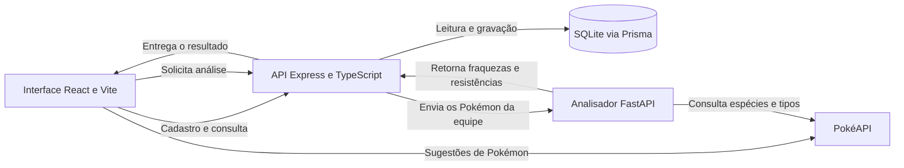

# Pokémon Hall of Fame

Um arquivo pessoal para registrar equipes que marcaram uma jornada Pokémon. Guarde quem treinou, em qual jogo a aventura aconteceu e quais companheiros chegaram ao fim dela. Depois, consulte a coleção e analise as fraquezas e resistências de cada equipe.

> Monte sua equipe. Registre sua jornada. Entre para o Hall da Fama.

## A proposta

Em uma aventura Pokémon, a equipe muda ao longo do caminho: alguns integrantes ficam desde o início, outros chegam para enfrentar um desafio específico. O Hall of Fame transforma essas histórias em registros que podem ser consultados e celebrados depois que os créditos acabam.

O projeto foi criado como uma aplicação full-stack de estudo e experimentação. Ele reúne uma interface React, uma API própria, um banco relacional leve e um serviço Python para análise de tipos. A ideia é praticar como diferentes partes de uma aplicação se conectam em uma experiência simples e útil para quem joga Pokémon, incluindo jogos principais e ROM hacks.

## O que já é possível fazer

- Registrar o nome do treinador, o jogo e notas sobre a jornada.
- Montar uma equipe de até seis Pokémon, com número na Pokédex, apelido e nível.
- Receber sugestões de nomes enquanto digita. Ao escolher uma sugestão, o número da Pokédex também é preenchido.
- Consultar os times salvos em uma galeria ordenada pelos registros mais recentes.
- Analisar fraquezas, resistências e vulnerabilidades recorrentes da equipe.
- Acompanhar no painel quantos times, Pokémon, equipes completas e jogos estão registrados.

## Como funciona



O cadastro e a galeria dependem do frontend, da API Node.js e do banco SQLite. A análise tática é opcional e também requer o serviço Python. As sugestões de nomes e a análise consultam a PokéAPI, portanto dependem de acesso à internet.

## Tecnologias

| Camada | Tecnologias | Responsabilidade |
| --- | --- | --- |
| Interface | React 18, Vite, Axios e CSS | Navegação, cadastro, sugestões e galeria |
| API | Node.js, Express e TypeScript | Rotas HTTP e integração entre os serviços |
| Persistência | Prisma ORM e SQLite | Jogos, equipes e integrantes |
| Análise | Python, FastAPI, Uvicorn e HTTPX | Relações de dano por tipo |
| Dados Pokémon | PokéAPI | Catálogo para sugestões e dados de espécies e tipos |

## Executar localmente

### Requisitos

- Node.js 18 ou superior e npm
- Python 3.10 ou superior
- Acesso à internet para autocomplete e análise de tipos

Inicie cada serviço em um terminal separado, a partir da raiz do repositório.

Os comandos abaixo estão escritos para Windows PowerShell. No macOS ou Linux, use `npm` e `npx` no lugar de `npm.cmd` e `npx.cmd`.

### 1. API e banco de dados

```powershell
cd backend
npm.cmd install
npx.cmd prisma generate
npx.cmd prisma db push
npm.cmd run dev
```

A API ficará em `http://localhost:3333`. O banco SQLite fica em `backend/prisma/dev.db`.

### 2. Serviço de análise Python

No Windows PowerShell:

```powershell
cd analyzer-service
python -m venv .venv
.\.venv\Scripts\python.exe -m pip install -r requirements.txt
.\.venv\Scripts\python.exe main.py
```

No macOS ou Linux, ative o ambiente com `source .venv/bin/activate` e execute `python -m pip install -r requirements.txt` e `python main.py`. No Windows, usar diretamente `python.exe` do ambiente virtual evita depender da permissão para executar scripts de ativação do PowerShell. O serviço ficará em `http://localhost:8000`; a documentação interativa do FastAPI estará em `http://localhost:8000/docs`.

### 3. Interface web

```powershell
cd frontend
npm.cmd install
npm.cmd run dev
```

Abra o endereço exibido pelo Vite, normalmente `http://localhost:5173`.

## Rotas da API

| Serviço | Método | Rota | Descrição |
| --- | --- | --- | --- |
| Node.js | `GET` | `/api/teams` | Lista equipes, jogos e Pokémon |
| Node.js | `POST` | `/api/teams` | Cria um time e seus Pokémon |
| Node.js | `GET` | `/api/teams/:id/analysis` | Busca um time e solicita sua análise |
| Python | `POST` | `/analyze-team` | Calcula fraquezas e resistências da equipe |

A interface usa `http://localhost:3333/api` como endereço-base da API. O backend permite definir outra porta pela variável `PORT`; se ela for alterada, atualize também a URL-base em `frontend/src/api.ts`. O endereço do analisador Python é definido em `backend/src/services/TeamService.ts`.

### Exemplo de cadastro

```http
POST /api/teams
Content-Type: application/json
```

```json
{
  "trainerName": "Ash Ketchum",
  "gameTitle": "Pokémon Emerald",
  "notes": "Uma jornada inesquecível pela região de Hoenn.",
  "pokemons": [
    {
      "pokemonName": "pikachu",
      "pokedexNumber": 25,
      "nickname": "Sparky",
      "level": 50,
      "slotPosition": 1
    }
  ]
}
```

A natureza não precisa ser informada: a API usa `Hardy` como padrão. `nickname` e `notes` são opcionais.

## Organização do repositório

```text
pokemon-hall-of-fame/
├── assets/
│   └── PHOF-LOGO.png          # Identidade visual do Hall da Fama
├── analyzer-service/
│   ├── main.py                 # API FastAPI e lógica de análise
│   └── requirements.txt        # Dependências Python
├── backend/
│   ├── prisma/
│   │   └── schema.prisma       # Modelos e configuração do SQLite
│   └── src/
│       ├── controllers/        # Tratamento das requisições HTTP
│       ├── services/           # Persistência e integração com o analisador
│       └── server.ts           # Inicialização da API Express
└── frontend/
    ├── index.html
    └── src/
        ├── components/         # Componentes reutilizáveis, incluindo autocomplete
        ├── App.jsx             # Composição das telas e interações
        ├── api.ts              # Cliente HTTP da aplicação
        └── app.css             # Identidade visual e responsividade
```

## Verificação do frontend

Para gerar a versão de produção e verificar a compilação da interface:

```powershell
cd frontend
npm run build
```

## Limitações atuais

- O catálogo de sugestões e os dados usados na análise dependem da disponibilidade da PokéAPI.
- Sem o serviço Python, cadastro e galeria continuam disponíveis, mas a análise tática não.
- O projeto está preparado para execução local; autenticação, publicação e configuração de produção ainda não fazem parte do fluxo atual.

## Ideias para evoluir

- Editar e remover equipes já registradas.
- Incluir natureza, habilidade, item e golpes no formulário.
- Adicionar filtros por jogo, treinador e Pokémon.
- Criar testes automatizados para API, persistência e análise.
- Preparar configuração de ambiente e publicação para produção.
